# 📌 Guide to Chunking Methods for RAG

## What is Chunking?
Chunking is the process of breaking down large text data into smaller, manageable segments for effective retrieval in **Retrieval-Augmented Generation (RAG)** applications. Chunking improves searchability, reduces computational costs, and enhances the performance of LLMs by providing structured and context-rich input.

## 🔹 **Consolidated List of Relevant Chunking Methods for RAG**

### **1️⃣ Basic Chunking Methods** (For Simple RAG & Modular RAG)
- **Fixed-Size Chunking**  
- **Token-Based Chunking**  
- **Sentence-Based Chunking**  
- **Paragraph-Based Chunking**  
- **Page-Based Chunking**  

### **2️⃣ Context-Preserving Chunking** (For Branched RAG & Adaptive RAG)
- **Sliding Window Chunking**  
- **Fixed Token with Overlap**  
- **Recursive Chunking**  
- **Recursive Python-Specific Chunking**  
- **Context-Enriched Chunking**  

### **3️⃣ Semantic & AI-Driven Chunking** (For Corrective RAG, Self-RAG & HyDE)
- **Semantic Chunking**  
- **Topic-Based Chunking**  
- **Entity-Based Chunking**  
- **Keyword-Based Chunking**  

### **4️⃣ Specialized Chunking for Structured Data** (For GraphRAG & Agentic RAG)
- **Hierarchical Chunking**  
- **Modality-Specific Chunking**  
- **Table-Aware Chunking**  

### **5️⃣ Task-Specific Chunking** (For Agentic RAG & Self-RAG)
- **Agentic Chunking**  
- **Subdocument Chunking**  

### **6️⃣ Hybrid & Multi-Method Chunking** (For Adaptive RAG & High-Complexity Systems)
- **Hybrid Chunking**  

---

## 🔍 How to Choose the Right Chunking Method?

The following decision tree helps in selecting the most appropriate chunking technique based on the structure and needs of your RAG application.

```mermaid
%%{init: {'theme': 'dark', 'themeVariables': { 'fontFamily': 'arial', 'fontSize': '16px'}}}%%
flowchart LR
    Start["What is your<br/>primary need for<br/>chunking?"] --> Basic["Simple and<br/>uniform chunking"]
    Start --> Context["Preserving context<br/>across boundaries"]
    Start --> Semantic["AI-driven chunking<br/>based on meaning"]
    Start --> Structured["Handling structured<br/>or specialized<br/>content"]
    Start --> TaskSpec["Task-specific or<br/>role-based<br/>chunking"]
    Start --> Hybrid["Combining multiple<br/>chunking methods"]

    %% Basic Chunking Methods
    Basic --> B1{"Need fixed-size<br/>chunks?"}
    Basic --> B2{"Working with<br/>token limits?"}
    Basic --> B3{"Preserve full<br/>sentences?"}
    Basic --> B4{"Prefer paragraph<br/>level?"}
    Basic --> B5{"Page structure<br/>matters?"}

    B1 --> Fixed["Fixed-Size<br/>Chunking"]
    B2 --> Token["Token-Based<br/>Chunking"]
    B3 --> Sentence["Sentence-Based<br/>Chunking"]
    B4 --> Para["Paragraph-Based<br/>Chunking"]
    B5 --> Page["Page-Based<br/>Chunking"]

    %% Context-Preserving Chunking
    Context --> C1{"Need overlapping<br/>context?"}
    Context --> C2{"Fixed tokens<br/>with overlap?"}
    Context --> C3{"Adaptive<br/>separator-based?"}
    Context --> C4{"Processing<br/>Python docs?"}
    Context --> C5{"Need metadata<br/>with chunks?"}

    C1 --> Sliding["Sliding Window<br/>Chunking"]
    C2 --> FixedOverlap["Fixed Token<br/>with Overlap"]
    C3 --> Recursive["Recursive<br/>Chunking"]
    C4 --> PythonChunk["Recursive Python-<br/>Specific Chunking"]
    C5 --> Enriched["Context-Enriched<br/>Chunking"]

    %% Semantic & AI-Driven Chunking
    Semantic --> S1{"Split by<br/>meaning?"}
    Semantic --> S2{"Distinct<br/>topics?"}
    Semantic --> S3{"Preserve named<br/>entities?"}
    Semantic --> S4{"Based on<br/>keywords?"}

    S1 --> SemChunk["Semantic<br/>Chunking"]
    S2 --> TopicChunk["Topic-Based<br/>Chunking"]
    S3 --> EntityChunk["Entity-Based<br/>Chunking"]
    S4 --> KeywordChunk["Keyword-Based<br/>Chunking"]

    %% Specialized Chunking
    Structured --> ST1{"Multi-level<br/>chunking?"}
    Structured --> ST2{"Mixed content<br/>types?"}
    Structured --> ST3{"Separate table<br/>processing?"}

    ST1 --> HierChunk["Hierarchical<br/>Chunking"]
    ST2 --> ModalChunk["Modality-Specific<br/>Chunking"]
    ST3 --> TableChunk["Table-Aware<br/>Chunking"]

    %% Task-Specific Chunking
    TaskSpec --> T1{"AI agent<br/>driven?"}
    TaskSpec --> T2{"Logical<br/>sub-sections?"}

    T1 --> AgentChunk["Agentic<br/>Chunking"]
    T2 --> SubDoc["Subdocument<br/>Chunking"]

    %% Hybrid Chunking
    Hybrid --> H1{"Multiple<br/>strategies?"}
    H1 --> HybridChunk["Hybrid<br/>Chunking"]

    %% Styling
    classDef default fill:#2d3436,stroke:#ffffff,stroke-width:2px,color:#ffffff
    classDef start fill:#6c5ce7,stroke:#ffffff,stroke-width:4px,color:#ffffff
    classDef question fill:#00b894,stroke:#ffffff,stroke-width:2px,color:#ffffff
    classDef category fill:#0984e3,stroke:#ffffff,stroke-width:2px,color:#ffffff
    classDef method fill:#e84393,stroke:#ffffff,stroke-width:2px,color:#ffffff
    
    class Start start
    class Basic,Context,Semantic,Structured,TaskSpec,Hybrid category
    class B1,B2,B3,B4,B5,C1,C2,C3,C4,C5,S1,S2,S3,S4,ST1,ST2,ST3,T1,T2,H1 question
    class Fixed,Token,Sentence,Para,Page,Sliding,FixedOverlap,Recursive,PythonChunk,Enriched,SemChunk,TopicChunk,EntityChunk,KeywordChunk,HierChunk,ModalChunk,TableChunk,AgentChunk,SubDoc,HybridChunk method

```

## 🤝 Contribution
Contributions are welcome to improve this repository! If you'd like to contribute:

Fork the repository and create a new branch.
Make your changes, ensuring they align with the project’s goals.
Submit a Pull Request and include a clear description of the update.
